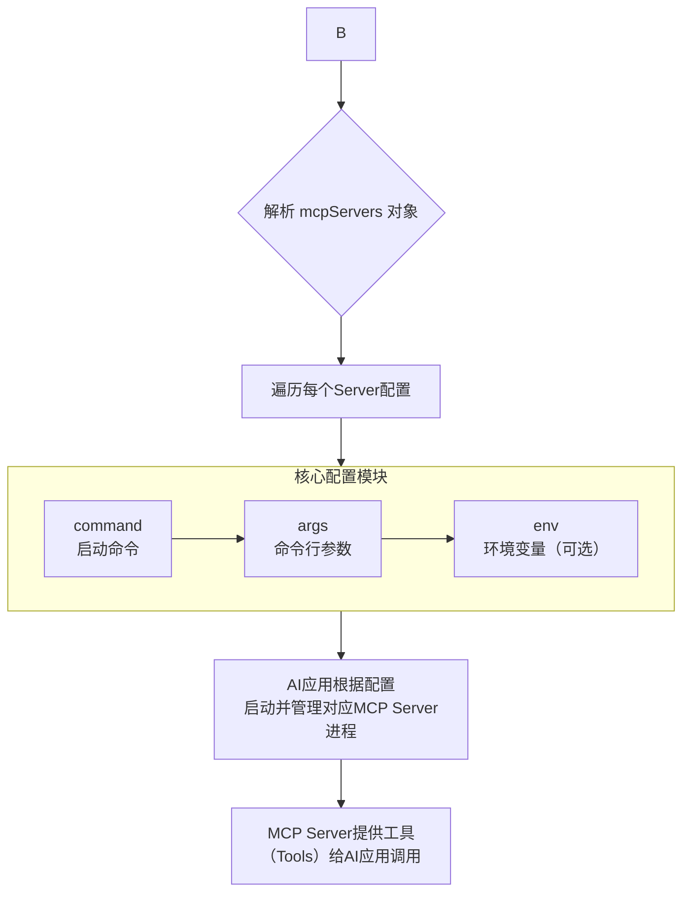

# 一、MCP基本概念
> Model Context Protocol -模型上下文协议，LLM与外部工具和数据源无缝集成的开放标准

## 1.整体介绍
<!-- 这是一张图片，ocr 内容为： -->


- MCP 由三个核心组件构成：Host（主机）、Client（客户端） 和 Server（服务器）。


## 2.MCP-Server
### 2.1 能力
- Tools：使大语言模型能够通过你的 Server 执行操作。
- Resources：将 Server 上的数据和内容开放给大语言模型。
- Prompts：创建可复用的提示词模板和工作流程。

### 2.2 通信类型
- stdio（标准输入输出, 本地文件、本地代码等）
- SSE （Server-Sent Events，服务器发送事件）

### 2.3 接入mcp-server
#### 1、NPX/UVX(Stdio)接入
> npx - node.js生态npm，uvx - python生态pip

+ 配置示例

```yaml
{
  "mcpServers": {
    "amap-maps": {
      "command": "npx",
      "args": ["-y","@amap/amap-maps-mcp-server"],
      "env": {
        "AMAP_MAPS_API_KEY": "您在高德官网上申请的key"
      }
    }
  }
}

```

- 常用配置解释

| 字段名 | 类型 | 必填 | 说明 |
| --- | --- | --- | --- |
| mcpServers | object | 是 | 所有 MCP 服务的集合，每个服务由 server_name 标识。 |
| server_name | object | 是 | 自定义服务名称 |
| disabled | boolean | 否 | 是否禁用，ture-当前服务不会被启动 |
| timeout | int | 否 | 服务启动/通信最大等待时间，默认值通常是 60 秒（单位：秒） |
| command | string | 是 | 启动命令（如 node、npx、uv）。 |
| args | List<String> | 是 | 命令参数（如［"-y"，"@amap/amap-maps-mcp-server"］）-y的作<br/>用：自动确认（Yes）或跳过交互式提示 |
| env | object | 否 | 环境变量（如 API密钥、数据库连接密码）。 |
| type | string | 否 | stdio：本地进程通信（如 Node.js、Python 脚本）sse：远程 API<br/>（需提供 URL） |


#### 2、SSE接入-本地/远程服务接口
- 配置示例

```yaml
{
  "mcpServers": {
    "amap-amap-sse": {
      "url": "https://mcp.amap.com/sse?key=您在高德官网上申请的key"
    }
  }
}
```

- 常用配置解释

| 字段名 | 类型 | 必填 | 说明 |
| --- | --- | --- | --- |
| mcpServers | object | 是 | 所有 MCP 服务的集合，每个服务由 server_name 标识。 |
| server_name | object | 是 | 自定义服务名称 |
| url | string | 是 | sse服务的地址 |
| disabled | boolean | 否 | 是否禁用，ture-当前服务不会被启动 |
| timeout | int | 否 | 服务启动/通信最大等待时间，默认值通常是 60 秒（单位：秒） |
| headers | object | 否 | sse链接时设置的请求头 |
| type | string | 否 | stdio：本地进程通信（如 Node.js、Python 脚本）sse：远程 API<br/>（需提供 URL） |


### 2.4 流程图





## 3.MCP-Client
### 3.1 作用
| **<font style="color:rgb(15, 17, 21);">作用类别</font>** | **<font style="color:rgb(15, 17, 21);">具体功能</font>** | **<font style="color:rgb(15, 17, 21);">价值</font>** |
| --- | --- | --- |
| **<font style="color:rgb(15, 17, 21);">协议层</font>** | <font style="color:rgb(15, 17, 21);">封装 MCP 协议细节</font> | <font style="color:rgb(15, 17, 21);">简化开发，降低复杂度</font> |
| **<font style="color:rgb(15, 17, 21);">连接层</font>** | <font style="color:rgb(15, 17, 21);">管理连接、重试、超时</font> | <font style="color:rgb(15, 17, 21);">提高可靠性</font> |
| **<font style="color:rgb(15, 17, 21);">工具层</font>** | <font style="color:rgb(15, 17, 21);">工具发现、调用、缓存</font> | <font style="color:rgb(15, 17, 21);">提升效率和性能</font> |
| **<font style="color:rgb(15, 17, 21);">安全层</font>** | <font style="color:rgb(15, 17, 21);">认证、授权、审计</font> | <font style="color:rgb(15, 17, 21);">保障安全合规</font> |
| **<font style="color:rgb(15, 17, 21);">监控层</font>** | <font style="color:rgb(15, 17, 21);">指标收集、日志记录</font> | <font style="color:rgb(15, 17, 21);">支持运维和优化</font> |
| **<font style="color:rgb(15, 17, 21);">集成层</font>** | <font style="color:rgb(15, 17, 21);">多种平台和语言支持</font> | <font style="color:rgb(15, 17, 21);">促进生态发展</font> |


**总结一下**

- **<font style="color:rgb(15, 17, 21);">让 AI 模型轻松使用远程工具</font>**<font style="color:rgb(15, 17, 21);">（抽象复杂性）</font>
- **<font style="color:rgb(15, 17, 21);">让开发者高效集成外部能力</font>**<font style="color:rgb(15, 17, 21);">（提供便利接口）</font>
- **<font style="color:rgb(15, 17, 21);">让企业安全可控地扩展 AI 能力</font>**<font style="color:rgb(15, 17, 21);">（提供企业级特性）</font>
- **<font style="color:rgb(15, 17, 21);">让整个 MCP 生态系统互联互通</font>**<font style="color:rgb(15, 17, 21);">（标准化交互）</font>

# 二、框架搭建
> SpringAi + SpringBoot
>

## 1. 项目结构
```yaml
ai-assisant
 |- mcp-client
    |- pom.xml 
 |- mcp-server
    |- pom.xml
 |- pom.xml
 |- README.md
```

## 2.MCP-Server
+ pom.xml

```xml
<properties>
  <java.version>17</java.version>
  <spring-ai-starter.version>1.0.0-M6</spring-ai-starter.version>
</properties>

<dependencyManagement>
  <dependencies>
    <dependency>
      <groupId>org.springframework.ai</groupId>
      <artifactId>spring-ai-bom</artifactId>
      <version>${spring-ai-starter.version}</version>
      <type>pom</type>
      <scope>import</scope>
    </dependency>
  </dependencies>
</dependencyManagement>


<dependencies>
  <dependency>
    <groupId>org.springframework.ai</groupId>
    <artifactId>spring-ai-mcp-server-webflux-spring-boot-starter</artifactId>
  </dependency>
</dependencies>
```

+ tool-service

```java
@Service
public class WeatherService{

    @Tool(name = "getWeatherByCity", description = "根据城市名称获取天气预报")
    public String getWeatherByCity(String city) {
        log.info("===============getWeatherByCity方法被调用：city="+city);
        Map<String, String> mockData = Map.of(
                "西安", "天气炎热",
                "北京", "晴空万里",
                "上海", "阴雨绵绵"
        );
        return mockData.getOrDefault(city, "未查询到对应城市！");
    }

    @Tool(name = "getTime", description = "获取当前时间")
    public String getTime() {
        SimpleDateFormat mockData = new SimpleDateFormat("yyyy-MM-dd HH:mm:ss");
        return mockData.format(System.currentTimeMillis());
    }
}

```

+ MethodToolConfig-注册工具

```java
@Component
public class MethodToolConfig {
    @Bean
    public ToolCallbackProvider weatherTools(WeatherService weatherService) {
        return MethodToolCallbackProvider.builder()
                .toolObjects(weatherService)
                .build();
    }
}

```

+ application.yml

```yaml
server:
  port: 8080
  shutdown: graceful

spring:
  ai:
    mcp:
      server:
        enabled: true
        name: ai-assistant
        version: 1.0.0
        capabilities:
          tool: true
        protocol: STREAMABLE
        
logging:
  level:
    root: info
    io.modelcontextprotocol: trace
    org.springframework.ai.mcp: trace
```

+ 运行


+ 访问接口验证


## 3.MCP-Client
+ pom

```xml
<properties>
  <java.version>17</java.version>
  <spring-ai.version>1.1.2</spring-ai.version>
  <spring-ai-starter.version>1.0.0-M6</spring-ai-starter.version>
</properties>

<dependencyManagement>
  <dependencies>
    <dependency>
      <groupId>org.springframework.ai</groupId>
      <artifactId>spring-ai-bom</artifactId>
      <version>${spring-ai-starter.version}</version>
      <type>pom</type>
      <scope>import</scope>
    </dependency>
  </dependencies>
</dependencyManagement>

<dependencies>
  <dependency>
    <groupId>org.springframework.ai</groupId>
    <artifactId>spring-ai-mcp-client-webflux-spring-boot-starter</artifactId>
    <version>${spring-ai-starter.version}</version>
  </dependency>
  <!-- 支持openai-api协议的都可以用这个包，接入其他api可替换为其他包  -->
  <dependency>
    <groupId>org.springframework.ai</groupId>
    <artifactId>spring-ai-openai-spring-boot-starter</artifactId>
    <version>${spring-ai-starter.version}</version>
  </dependency>
  <dependency>
    <groupId>org.springframework.boot</groupId>
    <artifactId>spring-boot-starter-web</artifactId>
  </dependency>
</dependencies>
```

+ config

```yaml
@Component
public class ChatClientConfig {
    @Bean
    public ChatClient chatClient(ChatClient.Builder chatClientBuilder,
                                 ToolCallbackProvider tools) {
        return chatClientBuilder
                .defaultTools(tools)
                .build();
    }
}

```

+ controller / commandline ,测试用，二选一即可

```xml
@RestController
@RequestMapping("/test")
public class TestController {

    @Autowired
    private ChatClient client;

    @GetMapping("/msg")
    public String msg(String msg){
        if(StringUtils.isBlank(msg)){
            return "请输入内容";
        }
        SystemPromptTemplate systemPromptTemplate = new SystemPromptTemplate("你的身份是私人助理，帮用户解决一切问题");
        Message systemMessage = systemPromptTemplate.createMessage();

        Message userMessage = new UserMessage(msg);
        Prompt prompt = new Prompt(List.of(userMessage, systemMessage));
        return client.prompt(prompt).call().content();
    }
}
```

```xml
/**
 * 调试
 */
@Component
public class ChatConfig {

    @Autowired
    private ChatClient chatClient;

    @Bean
    public CommandLineRunner predefinedQuestions(ToolCallbackProvider tools,
                                                 ConfigurableApplicationContext context) {
        return args -> {

            // 创建Scanner对象用于接收用户输入
            Scanner scanner = new Scanner(System.in);

            System.out.println(">>> 欢迎使用问答系统！输入'exit'退出程序。");

            while (true) {
                // 提示用户输入问题
                System.out.print("\n>>> QUESTION: ");
                String userInput = scanner.nextLine();

                // 如果用户输入"exit"，则退出循环
                if ("exit".equalsIgnoreCase(userInput)) {
                    System.out.println(">>> 已退出问答系统。");
                    break;
                }

                // 使用ChatClient与LLM交互
                try {
                    System.out.println("\n>>> ASSISTANT: " + chatClient.prompt(userInput).call().content());
                } catch (Exception e) {
                    System.out.println("\n>>> ERROR: 无法处理您的请求，请稍后再试。");
                    e.printStackTrace();
                }
            }

            // 关闭Spring上下文
            context.close();
            scanner.close();
        };
    }
}

```

+ application.yml

```xml
## 预留测试环境配置，调试用
server:
  port: 8082
  shutdown: graceful

spring:
  autoconfigure:
    #spring-ai bug,后续新版本已解决。https://github.com/spring-projects/spring-ai/pull/2493
    exclude: org.springframework.ai.autoconfigure.mcp.client.SseHttpClientTransportAutoConfiguration
  ai:
    openai:
      base-url: # 大模型api地址
      api-key: # api-key
      chat:
        options:
          model: #模型名称
          stream-usage: true
        # 豆包大模型使用：/api/v3/chat/completions
        completions-path: /api/v3/chat/completions
    mcp:
      client:
        type: ASYNC
        sse:  #其他类型配置参考上面的解释
          connections:
            server1:
              url: http://localhost:8081 #mcp-server接口地址
  application:
    name: mcpClient
  http:
    encoding:
      enabled: true
      force: true
      charset: UTF-8
  main:
    allow-bean-definition-overriding: true
    allow-circular-references: true

logging:
  level:
    root: info
    org.springframework.ai: debug
    org.springframework: error

```

## 4.运行示例
### 4.1 MCP-Client调用示例
+ mcp-client


+ mcp-server


### 4.2 其他工具使用示例
+ 配置


+ 运行

<!-- 这是一张图片，ocr 内容为： -->


# 三、扩展
### 3.1 skills
+ **<font style="color:rgb(25, 27, 31);">Claude Skills 是一种模块化的能力包（modular skill package）</font>**
  - <font style="color:rgb(25, 27, 31);">通俗来说就是一组标准化可复用的prompt</font>
+ 基础结构

```xml
skill-name/
├── SKILL.md (必需)
│   ├── YAML 前置元数据 (必需)
│   │   ├── name: (必需)
│   │   └── description: (必需)
│   └── Markdown 指令 (必需)
└── 打包资源 (可选)
    ├── scripts/     - 可执行代码
    ├── references/  - 上下文文档
    └── assets/      - 输出文件（模板等）
```

+ **<font style="color:rgb(25, 27, 31);">介绍</font>**

```xml
每个 Skill 是一个文件夹，通常包含：

- SKILL.md：说明书，描述用途、操作流程
- 脚本 / 模板：执行自动化任务的逻辑，比如处理 Excel、生成 PPT
- 资源文件：脚本依赖的代码片段、样式、流程图等
```

+ SKILL.md格式

```xml
---
name: 技能名称
description: 简要描述这个技能的功能和使用场景

---

# 技能名称

## 描述
描述这个技能的作用。

## 使用场景
描述触发这个技能的条件。

## 指令
清晰的分步说明，告诉智能体具体怎么做。

## 示例 (可选)
输入/输出示例，展示预期效果。

```

+ skills vs mcp

| **<font style="color:rgb(25, 27, 31);">对比项</font>** | **<font style="color:rgb(25, 27, 31);">Skills</font>** | **<font style="color:rgb(25, 27, 31);">MCP</font>** |
| :--- | :--- | :--- |
| <font style="color:rgb(25, 27, 31);">定位</font> | <font style="color:rgb(25, 27, 31);">任务执行模块</font> | <font style="color:rgb(25, 27, 31);">系统连接协议</font> |
| <font style="color:rgb(25, 27, 31);">核心能力</font> | <font style="color:rgb(25, 27, 31);">封装脚本和模板，直接执行任务</font> | <font style="color:rgb(25, 27, 31);">接入外部数据源、服务</font> |
| <font style="color:rgb(25, 27, 31);">使用方式</font> | <font style="color:rgb(25, 27, 31);">按需加载、像插件一样调用</font> | <font style="color:rgb(25, 27, 31);">开发者需配置、注册、连接系统</font> |
| <font style="color:rgb(25, 27, 31);">适合人群</font> | <font style="color:rgb(25, 27, 31);">日常办公 / 测试 / 文档自动化</font> | <font style="color:rgb(25, 27, 31);">企业级系统集成 / 跨平台任务</font> |
| <font style="color:rgb(25, 27, 31);">举例</font> | <font style="color:rgb(25, 27, 31);">生成测试报告、转文件格式</font> | <font style="color:rgb(25, 27, 31);">自动同步数据到 ERP、CI 系统</font> |


**<font style="color:rgb(25, 27, 31);">Skills + MCP = 模块执行 + 系统联动</font>**


# 四、相关链接
### MCP
+ MCP官方文档  [https://modelcontextprotocol.info/zh-cn](https://modelcontextprotocol.info/zh-cn/)
+ awesom-mcp-server(github 78.8k star)   [https://github.com/punkpeye/awesome-mcp-servers](https://github.com/punkpeye/awesome-mcp-servers)
+ MCP-World(国内)  [https://www.mcpworld.com/](https://www.mcpworld.com/)

### Skills
+ Agent-Skills文档: [https://code.claude.com/docs/zh-CN/skills](https://code.claude.com/docs/zh-CN/skills)
+ 官方技能包: [https://github.com/anthropics/skills?tab=readme-ov-file](https://github.com/anthropics/skills?tab=readme-ov-file)

