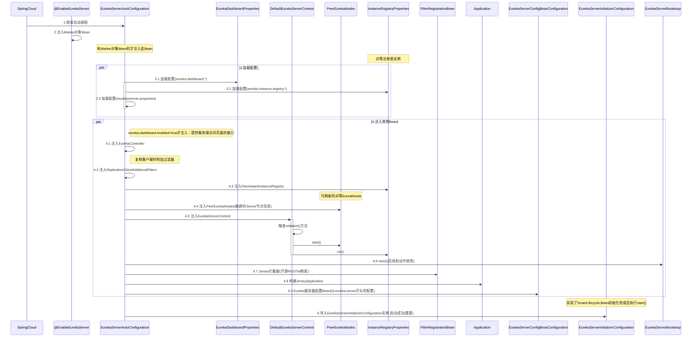
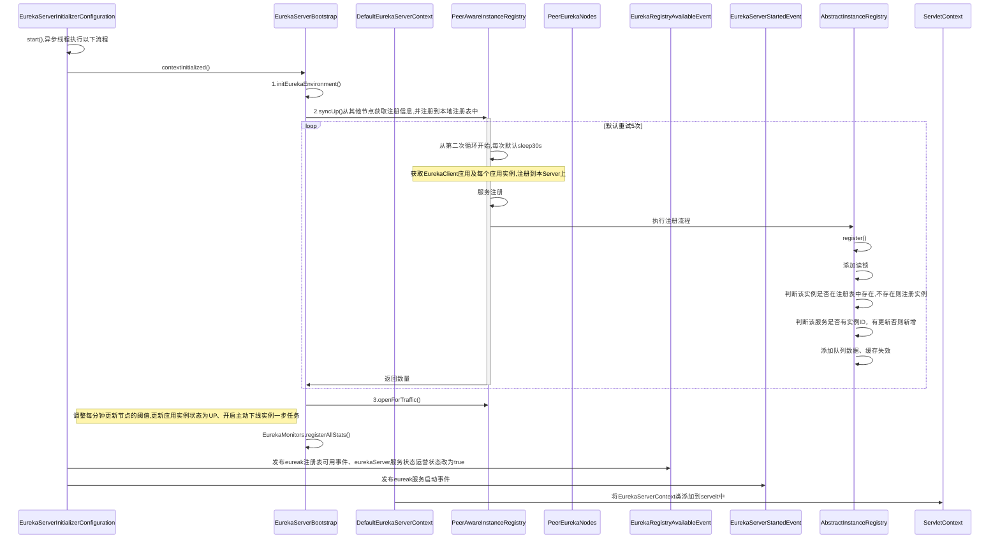

> 基于4R架构理论拆解: 顶层结构(Rank) --> 组成角色(Role) --> 角色关系(Relation) --> 运作规则(Rule)

# 一、Eureka是什么

```textmate
Eureka是一个基于REST协议(Representational State Transfer表述性状态转移)的服务,
Eureka还附带了一个基于java的客户端组件Eureka client，它使与服务的交互更加容易。
客户端还有一个内置的负载均衡器，用于进行基本的轮询负载平衡。
Eureka填补了中间层负载平衡的需求

REST扩展: 资源(URI)表述性状态转移 
    状态转移就是客户端通过一系列请求动作，推动服务端的资源状态发生变化，资源的状态可以在「创建-修改-查看-删除」之间转移。
```


## 1. 4R拆解

### 1.1.顶层结构

- Eureka Server：Eureka 服务端
- Eureka Client：Eureka 客户端

### 1.2.组成角色

- Eureka Server：Eureka 服务端
- Eureka Client：Eureka 客户端
  - Application Provider： 服务生产者
  - Application Consumer：服务消费者

### 1.3.角色关系

```textmate
EurekaServer维护注册表、主动从注册表中删除超时未续约的EurekaClient
EurekaClient向EurekaServer注册自己的服务、发心跳、下线、获取服务列表
ApplicationProvider提供服务
ApplicationConsumer消费服务
```

### 1.4.运作规律

```textmate
服务注册 Register: Client 端主动向 Server 端注册。
心跳续约 Renew: Client 默认会每隔30秒发送一次心跳到 Server 来完成续约。
主动下线 Cancel：Client 端在停机时（正常停止）主动向 Server 发送下线，提示Server端下掉自己的服务
获取服务列表 Get Registry：Client 从 Server 获取注册表，并将其缓存在本地。缓存信息默认每 30s 更新一次。
注册表同步 Replicate：多个 Server 之间通过 P2P 复制的方式完成服务注册表的同步。
服务剔除 Eviction：在默认的情况下，当 Client 连续 90 秒没有向 Server 发送服务续约，Server 会将该 Client 从服务注册列表删除。
```

## 2.目标

- [X]  EurekaServer启动流程
- [ ]  Eureka Server 处理注册请求
- [ ]  Eureka Server 服务信息同步
- [ ]  Eureka Serer 收到续约心跳请求的处理
- [ ]  服务续约
- [ ]  服务发现
- [ ]  服务注册入口
- [ ]  服务注册请求的发起
- [ ]  Eureka 的多级缓存设计
- [ ]  Eureka 自我保护机制

# 二、服务启动源码拆解

## 1.入口分析

> 以@EnableEurekaServer作为切入点开始分析

```java
//1.作用: 注入EurekaServerMarkerConfigurationMarker.Marker对象
@Target(ElementType.TYPE)
@Retention(RetentionPolicy.RUNTIME)
@Documented
@Import(EurekaServerMarkerConfiguration.class)
public @interface EnableEurekaServer {
}

@Configuration(proxyBeanMethods = false)
public class EurekaServerMarkerConfiguration {

  @Bean
  public Marker eurekaServerMarkerBean() {
    return new Marker();
  }

  class Marker {}
}

//2.作用: 加载配置、初始化EurekaServer相关类、启动服务
@Configuration(proxyBeanMethods = false)
@Import(EurekaServerInitializerConfiguration.class)
@ConditionalOnBean(EurekaServerMarkerConfiguration.Marker.class)
@EnableConfigurationProperties({ EurekaDashboardProperties.class,
        InstanceRegistryProperties.class })
@PropertySource("classpath:/eureka/server.properties")
public class EurekaServerAutoConfiguration implements WebMvcConfigurer {
}

// 3.SpringCloud自动装配了EurekaServerAutoConfiguration
/** 
org.springframework.boot.autoconfigure.EnableAutoConfiguration=\
        org.springframework.cloud.netflix.eureka.server.EurekaServerAutoConfiguration
**/
```

- 流程描述

```textmate
1.框架自动装配EnableAutoConfiguration
2.服务启动类添加@EnableEurekaServer,注入EurekaServerMarkerConfiguration.Marker
3.EurekaServerAutoConfiguration类的@ConditionalOnBean生效,EurekaServerAutoConfiguration开始初始化
```

## 2.启动过程序列图

### 2.1 主要流程



### 2.2 核心流程
> EurekaServerInitializerConfiguration类初始流程


## 3.EurekaServerAutoConfiguration配置类详解

> 主要作用是加载配置、注入其他配置类

```java
@Configuration(proxyBeanMethods = false)
/** 1.TODO【重要】启动EurekaServer服务、发布相关事件 **/
@Import(EurekaServerInitializerConfiguration.class)
/** 2.注入标记类 **/
@ConditionalOnBean(EurekaServerMarkerConfiguration.Marker.class)
/** 3.加载配置 **/
@EnableConfigurationProperties({ EurekaDashboardProperties.class,
		InstanceRegistryProperties.class })
@PropertySource("classpath:/eureka/server.properties")
public class EurekaServerAutoConfiguration implements WebMvcConfigurer {

	/**
	 * List of packages containing Jersey resources required by the Eureka server.
	 */
	private static final String[] EUREKA_PACKAGES = new String[] {
			"com.netflix.discovery", "com.netflix.eureka" };
	@Autowired
	private ApplicationInfoManager applicationInfoManager;
	@Autowired
	private EurekaServerConfig eurekaServerConfig;
	@Autowired
	private EurekaClientConfig eurekaClientConfig;
	@Autowired
	private EurekaClient eurekaClient;
	@Autowired
	private InstanceRegistryProperties instanceRegistryProperties;

	/** 提供服务端访问页面的接口 **/
	@Bean
	@ConditionalOnProperty(prefix = "eureka.dashboard", name = "enabled",
			matchIfMissing = true)
	public EurekaController eurekaController() {
		return new EurekaController(this.applicationInfoManager);
	}

	/** client实例注册 **/
	@Bean
	public PeerAwareInstanceRegistry peerAwareInstanceRegistry(
			ServerCodecs serverCodecs) {
		this.eurekaClient.getApplications(); // force initialization
		return new InstanceRegistry(this.eurekaServerConfig, this.eurekaClientConfig,
				serverCodecs, this.eurekaClient,
				this.instanceRegistryProperties.getExpectedNumberOfClientsSendingRenews(),
				this.instanceRegistryProperties.getDefaultOpenForTrafficCount());
	}

	/** 可刷新的eureka节点 **/
	@Bean
	@ConditionalOnMissingBean
	public PeerEurekaNodes peerEurekaNodes(PeerAwareInstanceRegistry registry,
			ServerCodecs serverCodecs,
			ReplicationClientAdditionalFilters replicationClientAdditionalFilters) {
		return new RefreshablePeerEurekaNodes(registry, this.eurekaServerConfig,
				this.eurekaClientConfig, serverCodecs, this.applicationInfoManager,
				replicationClientAdditionalFilters);
	}

	/** eureka服务上下文 **/
	@Bean
	@ConditionalOnMissingBean
	public EurekaServerContext eurekaServerContext(ServerCodecs serverCodecs,
			PeerAwareInstanceRegistry registry, PeerEurekaNodes peerEurekaNodes) {
		return new DefaultEurekaServerContext(this.eurekaServerConfig, serverCodecs,
				registry, peerEurekaNodes, this.applicationInfoManager);
	}

	/** 初始化Eureka-server,初始化服务节点并注册 **/
	@Bean
	public EurekaServerBootstrap eurekaServerBootstrap(PeerAwareInstanceRegistry registry,
			EurekaServerContext serverContext) {
		return new EurekaServerBootstrap(this.applicationInfoManager,
				this.eurekaClientConfig, this.eurekaServerConfig, registry,
				serverContext);
	}

	/** 配置拦截器，ServletContainer里面实现了jersey框架，通过他来实现eurekaServer对外的restFull接口 **/
	/** jersey框架 开源的RESTful框架, 实现了JAX-RS (JSR 311 & JSR 339) 规范
	 * Register the Jersey filter.
	 * @param eurekaJerseyApp an {@link Application} for the filter to be registered
	 * @return a jersey {@link FilterRegistrationBean}
	 */
	@Bean
	public FilterRegistrationBean<?> jerseyFilterRegistration(
			javax.ws.rs.core.Application eurekaJerseyApp) {
		FilterRegistrationBean<Filter> bean = new FilterRegistrationBean<Filter>();
		bean.setFilter(new ServletContainer(eurekaJerseyApp));
		bean.setOrder(Ordered.LOWEST_PRECEDENCE);
		bean.setUrlPatterns(
				Collections.singletonList(EurekaConstants.DEFAULT_PREFIX + "/*"));

		return bean;
	}

	/**
	 * 构建Jersey应用程序和Eureka服务器所需的所有资源。
	 */
	@Bean
	public javax.ws.rs.core.Application jerseyApplication(Environment environment,
			ResourceLoader resourceLoader) {
  
          ClassPathScanningCandidateComponentProvider provider = new ClassPathScanningCandidateComponentProvider(
                  false, environment);
  
          // Filter to include only classes that have a particular annotation.
          provider.addIncludeFilter(new AnnotationTypeFilter(Path.class));
          provider.addIncludeFilter(new AnnotationTypeFilter(Provider.class));
  
          // Find classes in Eureka packages (or subpackages)
          Set<Class<?>> classes = new HashSet<>();
          for (String basePackage : EUREKA_PACKAGES) {
              Set<BeanDefinition> beans = provider.findCandidateComponents(basePackage);
              for (BeanDefinition bd : beans) {
                  Class<?> cls = ClassUtils.resolveClassName(bd.getBeanClassName(),
                          resourceLoader.getClassLoader());
                  classes.add(cls);
              }
          }
  
          // Construct the Jersey ResourceConfig
          Map<String, Object> propsAndFeatures = new HashMap<>();
          propsAndFeatures.put(
                  // Skip static content used by the webapp
                  ServletContainer.PROPERTY_WEB_PAGE_CONTENT_REGEX,
                  EurekaConstants.DEFAULT_PREFIX + "/(fonts|images|css|js)/.*");
  
          DefaultResourceConfig rc = new DefaultResourceConfig(classes);
          rc.setPropertiesAndFeatures(propsAndFeatures);
  
          return rc;
	}

	@Bean
	@ConditionalOnBean(name = "httpTraceFilter")
	public FilterRegistrationBean<?> traceFilterRegistration(
			@Qualifier("httpTraceFilter") Filter filter) {
		FilterRegistrationBean<Filter> bean = new FilterRegistrationBean<Filter>();
		bean.setFilter(filter);
		bean.setOrder(Ordered.LOWEST_PRECEDENCE - 10);
		return bean;
	}

	/** 配置 Eureka服务器配置Bean **/
	@Configuration(proxyBeanMethods = false)
	protected static class EurekaServerConfigBeanConfiguration {

		@Bean
		@ConditionalOnMissingBean
		public EurekaServerConfig eurekaServerConfig(EurekaClientConfig clientConfig) {
			EurekaServerConfigBean server = new EurekaServerConfigBean();
			if (clientConfig.shouldRegisterWithEureka()) {
				//设置注册表同步重试次数
				server.setRegistrySyncRetries(5);
			}
			return server;
		}
	}
}
```

## 4.EurekaServerInitializerConfiguration源码

> 主要作用管理EurekaServer服务生命周期

```java
/** 
 * 实现了Lifecycle方法，对象初始化完成后开始执行start()、对象销毁时调用stop()
 * **/
@Configuration(proxyBeanMethods = false)
public class EurekaServerInitializerConfiguration
        implements ServletContextAware, SmartLifecycle, Ordered {
    
    @Override
    public void start() {
      new Thread(() -> {
        try {
          /** TODO【重要】初始化环境变量、启动EurekaServer节点、同步注册表信息等 **/
          eurekaServerBootstrap.contextInitialized(
                  EurekaServerInitializerConfiguration.this.servletContext);
          log.info("Started Eureka Server");
  
          //发布注册表可用事件
          publish(new EurekaRegistryAvailableEvent(getEurekaServerConfig()));
        
          //设置EurekaServer服务状态为running
          EurekaServerInitializerConfiguration.this.running = true;
        
          //发布EurekaServer启动成功事件
          publish(new EurekaServerStartedEvent(getEurekaServerConfig()));
        } catch (Exception ex) {
          // Help!
          log.error("Could not initialize Eureka servlet context", ex);
        }
      }).start();
    }
  
    /** bean销毁前运行 **/
    @Override
    public void stop() {
        this.running = false;
        eurekaServerBootstrap.contextDestroyed(this.servletContext);
    }
}
```

### 4.1.EurekaServerBootstrap源码解析

> 启动引导, 提供初始化、销毁方法

```java
class EurekaServerBootstrap{
    /** 初始化EurekaServerContext **/
    public void contextInitialized(ServletContext context) {
        try {
            //初始化环境变量
            initEurekaEnvironment();
            //TODO【重要】初始化Eureka节点列表、同步注册表信息等
            initEurekaServerContext();
          
            context.setAttribute(EurekaServerContext.class.getName(), this.serverContext);
        } catch (Throwable e) {
            log.error("Cannot bootstrap eureka server :", e);
            throw new RuntimeException("Cannot bootstrap eureka server :", e);
        }
    }

    /** 销毁EurekaServerContext **/
    public void contextDestroyed(ServletContext context) {
      try {
          log.info("Shutting down Eureka Server..");
          context.removeAttribute(EurekaServerContext.class.getName());
  
          //关闭Eureka监视器、关闭上下文等
          destroyEurekaServerContext();
        
          //用户可以重写次方法来清理环境变量
          destroyEurekaEnvironment();
      } catch (Throwable e) {
        log.error("Error shutting down eureka", e);
      }
      log.info("Eureka Service is now shutdown...");
    }


  protected void initEurekaServerContext() throws Exception {
    // For backward compatibility
    JsonXStream.getInstance().registerConverter(new V1AwareInstanceInfoConverter(),
            XStream.PRIORITY_VERY_HIGH);
    XmlXStream.getInstance().registerConverter(new V1AwareInstanceInfoConverter(),
            XStream.PRIORITY_VERY_HIGH);

    if (isAws(this.applicationInfoManager.getInfo())) {
      this.awsBinder = new AwsBinderDelegate(this.eurekaServerConfig,
              this.eurekaClientConfig, this.registry, this.applicationInfoManager);
      this.awsBinder.start();
    }

    //初始化上下文holder
    EurekaServerContextHolder.initialize(this.serverContext);

    log.info("Initialized server context");

    //从相邻节点同步注册信息
    int registryCount = this.registry.syncUp();

    //启动各种异步任务、修改实例状态为UP、开启实例主动下线任务
    this.registry.openForTraffic(this.applicationInfoManager, registryCount);

    // 注册所有监控统计信息。
    EurekaMonitors.registerAllStats();
  }
}

```

#### 4.1.1.EurekaServerContext详解

> 实际是初始化了DefaultEurekaServerContext类,在EurekaServerAutoConfiguration中初始化
```java
@Singleton
public class DefaultEurekaServerContext implements EurekaServerContext {
    private static final Logger logger = LoggerFactory.getLogger(DefaultEurekaServerContext.class);
  
    private final PeerAwareInstanceRegistry registry;
    private final PeerEurekaNodes peerEurekaNodes;

    @PostConstruct
    @Override
    public void initialize() {
      logger.info("Initializing ...");
      /**
       * TODO【重要】
       * 1.创建单线程池作为异步任务线程
       * 2.更新eureka节点集合
       * 3.创建一个周期性异步任务
       *     10分钟更新一次eureka节点集合
       * **/
      peerEurekaNodes.start();
      try {
          /** 
           * TODO【重要】
           * 1.60s更新一次最近最小复制次数
           * 2.初始化响应缓存、开启定时更新client端缓存任务,30s更新一次
           * 3.开启定时更新<更新阈值>任务。更新阈值将用于确定是否由于网络分区而导致更新数量急剧下降，并保护一次过期的实例过多。
           * 4.初始化注册中心
           * **/
        registry.init(peerEurekaNodes);
      } catch (Exception e) {
        throw new RuntimeException(e);
      }
      logger.info("Initialized");
    }
  
    /** 关闭各种容器、监视器等 **/
    @PreDestroy
    @Override
    public void shutdown() {
      logger.info("Shutting down ...");
      registry.shutdown();
      peerEurekaNodes.shutdown();
      ServoControl.shutdown();
      EurekaMonitors.shutdown();
      logger.info("Shut down");
    }
    //。。。
}

```

### 4.2.peerEurekaNodes.start()分析

> 更新节点集合，并定义定时更新节点集合任务

```java
@Singleton
public class PeerEurekaNodes {
    public void start() {
        //单线程线程池
        taskExecutor = Executors.newSingleThreadScheduledExecutor(
                new ThreadFactory() {
                  @Override
                  public Thread newThread(Runnable r) {
                    Thread thread = new Thread(r, "Eureka-PeerNodesUpdater");
                    thread.setDaemon(true);
                    return thread;
                  }
                }
        );
        try {
          
            //更新eureka节点集合
            updatePeerEurekaNodes(resolvePeerUrls());
          
            //定义异步任务
            Runnable peersUpdateTask = new Runnable() {
              @Override
              public void run() {
                try {
                  updatePeerEurekaNodes(resolvePeerUrls());
                } catch (Throwable e) {
                  logger.error("Cannot update the replica Nodes", e);
                }
              }
            };

            //10分钟执行一次更新eureka节点任务
            taskExecutor.scheduleWithFixedDelay(
                    peersUpdateTask,
                    serverConfig.getPeerEurekaNodesUpdateIntervalMs(),
                    serverConfig.getPeerEurekaNodesUpdateIntervalMs(),
                    TimeUnit.MILLISECONDS
            );
        } catch (Exception e) {
          throw new IllegalStateException(e);
        }
        for (PeerEurekaNode node : peerEurekaNodes) {
          logger.info("Replica node URL:  {}", node.getServiceUrl());
        }
    }
  
    //解析eureka节点url
    protected List<String> resolvePeerUrls() {
        InstanceInfo myInfo = applicationInfoManager.getInfo();
        String zone = InstanceInfo.getZone(clientConfig.getAvailabilityZones(clientConfig.getRegion()), myInfo);
        List<String> replicaUrls = EndpointUtils
                .getDiscoveryServiceUrls(clientConfig, zone, new EndpointUtils.InstanceInfoBasedUrlRandomizer(myInfo));
      
        int idx = 0;
        while (idx < replicaUrls.size()) {
          if (isThisMyUrl(replicaUrls.get(idx))) {
            replicaUrls.remove(idx);
          } else {
            idx++;
          }
        }
        return replicaUrls;
    }
  
    //更新Eureka节点信息集合
    protected void updatePeerEurekaNodes(List<String> newPeerUrls) {
      if (newPeerUrls.isEmpty()) {
        logger.warn("The replica size seems to be empty. Check the route 53 DNS Registry");
        return;
      }
  
      Set<String> toShutdown = new HashSet<>(peerEurekaNodeUrls);
      toShutdown.removeAll(newPeerUrls);
      Set<String> toAdd = new HashSet<>(newPeerUrls);
      toAdd.removeAll(peerEurekaNodeUrls);
  
      if (toShutdown.isEmpty() && toAdd.isEmpty()) { // No change
        return;
      }
  
      // Remove peers no long available
      List<PeerEurekaNode> newNodeList = new ArrayList<>(peerEurekaNodes);
  
      if (!toShutdown.isEmpty()) {
        logger.info("Removing no longer available peer nodes {}", toShutdown);
        int i = 0;
        while (i < newNodeList.size()) {
          PeerEurekaNode eurekaNode = newNodeList.get(i);
          if (toShutdown.contains(eurekaNode.getServiceUrl())) {
              newNodeList.remove(i);
              eurekaNode.shutDown();
          } else {
              i++;
          }
        }
      }
  
      // Add new peers
      if (!toAdd.isEmpty()) {
        logger.info("Adding new peer nodes {}", toAdd);
        for (String peerUrl : toAdd) {
            newNodeList.add(createPeerEurekaNode(peerUrl));
        }
      }
  
      this.peerEurekaNodes = newNodeList;
      this.peerEurekaNodeUrls = new HashSet<>(newPeerUrls);
    }
}
```

### 4.3.registry.init()分析

> 初始化响应缓存、处理二级缓存相关业务逻辑

```java
@Singleton
public class PeerAwareInstanceRegistryImpl extends AbstractInstanceRegistry implements PeerAwareInstanceRegistry {
    @Override
    public void init(PeerEurekaNodes peerEurekaNodes) throws Exception {
        //1分钟更新一次最后最小复制数
        this.numberOfReplicationsLastMin.start();
        this.peerEurekaNodes = peerEurekaNodes;
      
        /** 
         * 初始化响应缓存，过期时间
         * 此处做了两级缓存，根据shouldUseReadOnlyResponseCache=true判断，默认true
         *     ps:通过eureka.shouldUseReadOnlyResponseCache配置
         *  
         *  readWriteCacheMap(二级缓存,缓存180s)、readOnlyCacheMap(三级缓存,30s刷新一次)
         *      readOnlyCacheMap 定时从 readWriteCacheMap 中更新缓存
         * **/
        initializedResponseCache();
        scheduleRenewalThresholdUpdateTask();
        initRemoteRegionRegistry();
  
        try {
          Monitors.registerObject(this);
        } catch (Throwable e) {
          logger.warn("Cannot register the JMX monitor for the InstanceRegistry :", e);
        }
    }
}
```

- Eureka中的三级缓存

| 缓存                    | 数据类型                                                    | 源码中位置                        | 描述                                                                           |
| ------------------------- | ------------------------------------------------------------- | ----------------------------------- | -------------------------------------------------------------------------------- |
| registry(一级)          | ConcurrentHashMap<String, Map<String, Lease<InstanceInfo>>> | AbstractInstanceRegistry.registry | 实时更新，又称**注册表**，UI界面从这里获取服务注册信息                         |
| readWriteCacheMap(二级) | com.google.common.cache.LoadingCache                        | ResponseCacheImpl                 | 缓存时间默认180秒(eureka.responseCacheAutoExpirationInSeconds配置)             |
| readOnlyCacheMap(三级)  | ConcurrentHashMap                                           | ResponseCacheImpl                 | 每30s同步readWriteCacheMap数据，EurekaClient默认从这里获取服务注册信息(可配置) |

- init中计算任务开始时间代码示例

```java
class Test {
  /** registry.init()中计算任务开始时间 **/
  public static void main(String[] args) throws InterruptedException {
    int responseCacheUpdateIntervalMs = 30 * 1000;
    for(int i=0; i<3; i++){
      Thread.sleep(1000);
      Date dt = new Date(
              ( (System.currentTimeMillis() / responseCacheUpdateIntervalMs) * responseCacheUpdateIntervalMs)
                      + responseCacheUpdateIntervalMs);
      System.out.println(DateUtils.formatDateYMDHMS(dt));
    }
  }

  /**
   * 结果: 
   * 2022-11-23 14:45:30
   * 2022-11-23 14:45:30
   * 2022-11-23 14:45:30
   * **/
}
```

### 同步集群节点注册表 PeerAwareInstanceRegistry.syncUp()
```java
class PeerAwareInstanceRegistry {
    @Override
    public int syncUp() {
      // 统计同步到本地注册表的实例数
      int count = 0;
    
      // 默认重试5次，每次间隔30秒, 成功一次则不再重试
      for (int i = 0; ((i < serverConfig.getRegistrySyncRetries()) && (count == 0)); i++) {
        if (i > 0) {
          try {
            Thread.sleep(serverConfig.getRegistrySyncRetryWaitMs());
          } catch (InterruptedException e) {
            logger.warn("Interrupted during registry transfer..");
            break;
          }
        }
        // 拉取集群节点注册表中的服务实例信息
        Applications apps = eurekaClient.getApplications();
        for (Application app : apps.getRegisteredApplications()) {
          for (InstanceInfo instance : app.getInstances()) {
            try {
              if (isRegisterable(instance)) {
                  //TODO【重要】注册实例到本地注册表
                  register(instance, instance.getLeaseInfo().getDurationInSecs(), true);
                  count++;
              }
            } catch (Throwable t) {
              logger.error("During DS init copy", t);
            }
          }
        }
      }
      return count;
    }
}
```


# 相关资料

- [spring-cloud-netflix源码地址](https://github.com/spring-cloud/spring-cloud-netflix)
