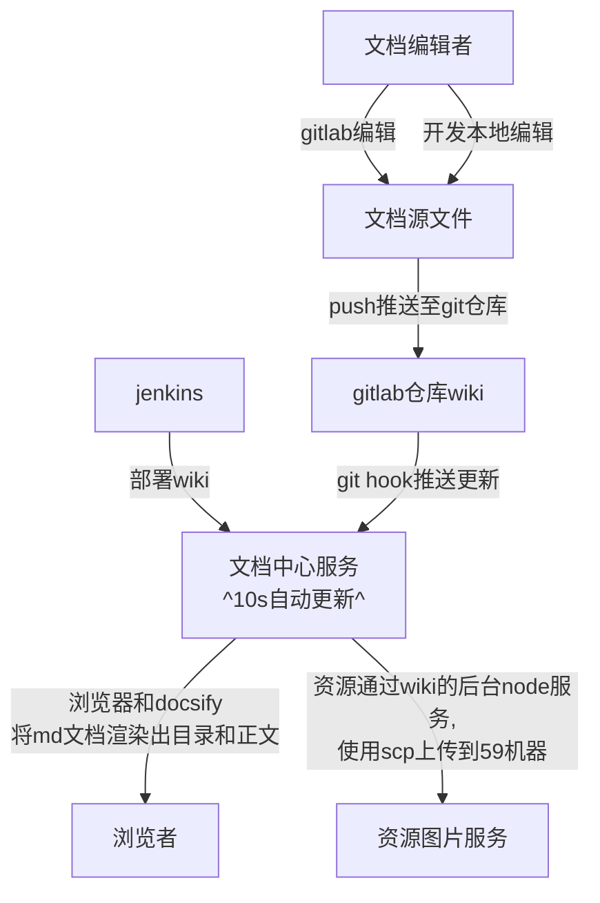

# 技术文档中心使用说明

## wiki文档中心技术架构


## 如何修改菜单，

```markdown
0. 默认当前服务地址：{ {baseDomain} } 需去掉'{ {'和'} }'中的空格。会自动解析成{{baseDomain}}
1. 修改主目录菜单：     main/wiki/sidebar.md
2. 修改具体业务目录菜单: doc/api/wiki/sidebar.md
3. 子菜单,具体由业务文档自动生成  
4. 插入图片：
5. 指定打开sidebar=doc/ops菜单中的页面：  - [ECS部署]({{baseDomain}}/browse/?sidebar=doc/ops&module=/doc/ops/resource/ecs/ecs#/)
6. 指定打开某个单独页面： ({ {baseDomain} }/browse/#/doc/develop/back-end/technique/malfunction/record)
7. 指定页面插入sql文件:[交易平台]({ {baseDomain} }/wiki/md?md=doc/develop/back-end/middleground/sql/trade.sql&type=sql&name=trade.md ':include :type=md')
8. 插入markdown页面: [商品系统](../product/product-programming.md ':include :type=md')
```

## 如何编辑文档
  - [docsify](https://docsify.js.org/#/zh-cn/more-pages)(wiki框架)
  - [markdown语法](http://xianbai.me/learn-md/article/about/helloworld.html)
  - [Haroopad编辑器](http://pad.haroopress.com/user.html)
  - [工作流和甘特图](https://mermaidjs.github.io/flowchart.html)
  - [在线甘特图工具](https://mermaidjs.github.io/mermaid-live-editor)
  - [emoji表情](https://www.webfx.com/tools/emoji-cheat-sheet/)

## 编辑器推荐
  - Idea(git版本管理)
```git
git clone ssh://git@git.mbyundian.com:23/maidao/wiki.git
```  
  - [GitLab 在线编辑](https://git.mbyundian.com/maidao/wiki/tree/master)
  - Sublime Text   
 

## 目录说明
```markdown
- auto-test 基于js实现端对端测试
- doc 文档(markdown格式)
 - api  脉宝api接口
 - develop 开发文档
    - back-end  大后端文档
    - front-end 大前端文档 
 - ops  运维相关
 
- main 文档中心服务
  - dist 文档中心静态资源(css、js)
  - node-express (node express web框架)
    - node_modules node 依赖包(注意不要提交到git)
    - web (node express web代码,node 服务开发)
      + conf 配置文件
      + dao  sqlDao
      + model bean 对象
      + routes url路由 
  - wiki 
      - sidebar 主页左侧菜单(可修改,不能删除)
      - home   主页(默认)内容(可修改,不能删除)
   - run-node-express.bat  windows服务启用命令
   - run-node-express.sh   mac服务启用命令
```
## 演示
- [开始使用](http://192.168.1.59/wiki/dist/20180809/08036a839f76.mp4)
- [gitlab编辑内容](http://192.168.1.59/wiki/dist/20180809/11e5fa01af7c.mp4)-(点击404时联系后端分配git权限)
- [idea菜单管理](http://192.168.1.59/wiki/dist/20180809/e6918f0b0b34.mp4)
- [上传多媒体](http://192.168.1.59/wiki/dist/20180809/7152fbd1b9d3.mp4)

## **本地启动文档服务**
### 安装node
- 下载&安装node： https://nodejs.org/en/download/ 
- 安装淘宝npm：   npm install -g cnpm --registry=https://registry.npm.taobao.org
- 安装supervisor（类似热加载）：   cnpm -g install supervisor

### 启动项目
- $>  cd main 
- mac系统输入命令     ./run-node-express.sh
- windows系统命令     run-node-express.bat

### 访问项目
http://localhost:3300
 
### 公司内网环境Docker
 http://192.168.1.200:3300
 
### 在线ide编辑
```docker 
docker pull webide/webide
docker rm -f wiki-webide
docker run --name wiki-webide -d -p 3301:8080 -v /storage/data/wiki-webide:/root/.coding-ide webide/webide
```
http://192.168.1.201:3301


