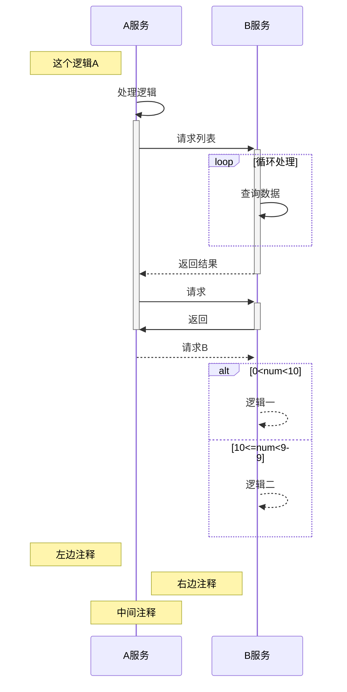

### mermaid画图

#### 序列图

```mermaid
sequenceDiagram
    participant serverA as A服务
    participant serverB as B服务
    
    note left of serverA : 这个逻辑A
    serverA->> serverA: 处理逻辑
    
    activate serverA
        serverA->> +serverB: 请求列表
        loop  循环处理
            serverB->>serverB: 查询数据
        end
        serverB-->> -serverA: 返回结果
        
        serverA->>+serverB: 请求
        serverB->>-serverA: 返回
    deactivate serverA
    
    serverA-->>+serverB: 请求B
    alt 0<num<10
        serverB-->>serverB: 逻辑一
    else 10<=num<99
        serverB-->>serverB: 逻辑二
    end
    
    note left of serverA : 左边注释
    note right of serverA : 右边注释
    note over serverA : 中间注释
    
    
```

### 参考资料
- [mermaid官网](https://mermaid-js.github.io/mermaid/#/README)
- [Markdown画序列图](https://blog.csdn.net/zhw21w/article/details/125749449)
